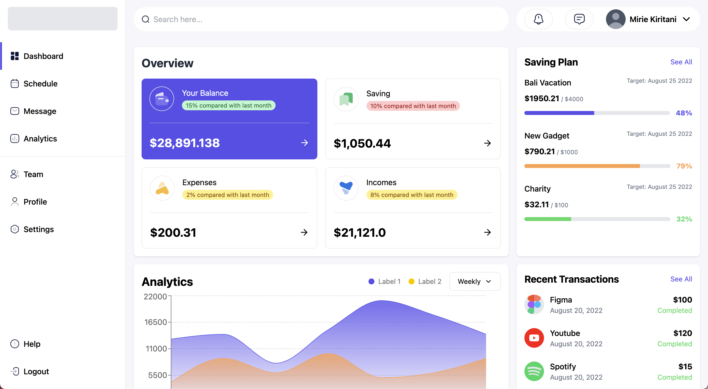

# Financial Dashboard UI

A responsive financial dashboard interface built with React, TypeScript, and Vite.

## Project Overview

This project demonstrates my frontend development skills through the implementation of a financial dashboard UI. The dashboard includes multiple interactive components and responsive layouts that adapt to various screen sizes.



## Features

- **Responsive Layout**: Fully adaptable interface that works on mobile, tablet, and desktop devices
- **Overview Section**: Displays financial metrics including balance, savings, expenses, and income
- **Saving Plans Tracker**: Visual progress indicators for different financial goals
- **Analytics Chart**: Interactive area chart showing financial trends over time
- **Recent Transactions**: List of latest financial activities with status indicators

## Technical Implementation

- **React & TypeScript**: Built with functional components and strong typing
- **CSS Grid & Flexbox**: Used for responsive layout management
- **Recharts**: Implemented for data visualization
- **Component-Based Architecture**: Modular design for maintainable code

## Design Choices

- Used a grid-based layout system to ensure proper section height alignment
- Implemented card components with consistent styling across the interface
- Created responsive breakpoints to optimize the user experience across devices
- Added visual indicators (colors, progress bars) to enhance data comprehension

## Installation and Setup

```bash
# Clone the repository
git clone [repository-url]

# Navigate to project directory
cd financial-dashboard

# Install dependencies
npm install

# Run development server
npm run dev
```

## Build Process

```bash
# Create production build
npm run build

# Preview production build
npm run preview
```

## Potential Enhancements

- Add dark mode theme toggle
- Implement interactive filters for the analytics chart
- Create additional dashboard views for different financial metrics
- Add animations for improved user experience

---

_Submitted as part of the application for Frontend Developer role_
